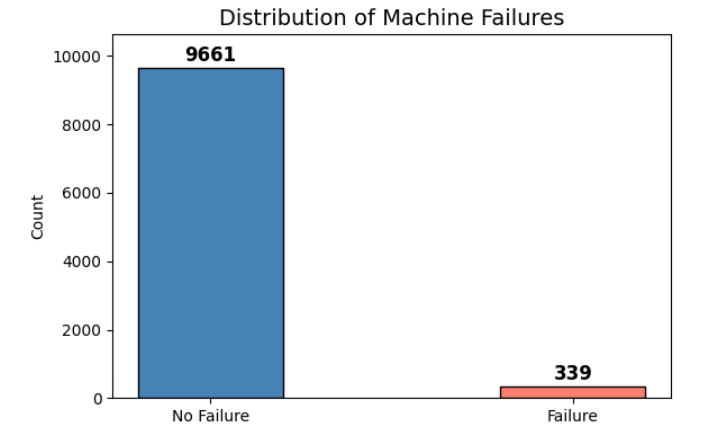
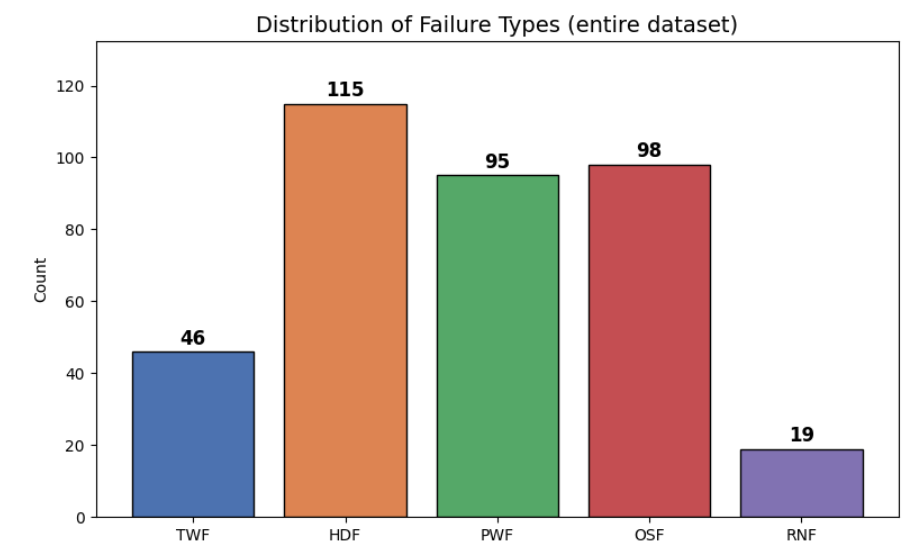
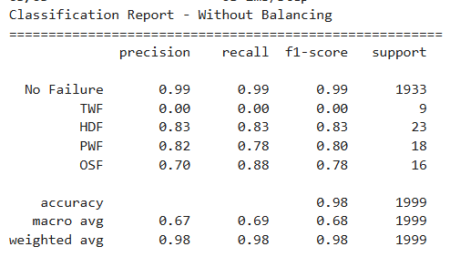
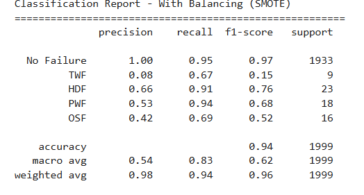

<div align="center">
  
</div>

# Projet IA Embarquée — Maintenance Prédictive sur STM32

**Électif IA et Data Analytics — MINES Saint-Étienne**

| | |
|---|---|
| **Auteurs** | SAYED AHMAD Hussein & NASR Rock |
| **Année** | 2025-2026 |

---

## Objectif

Ce projet s'inscrit dans le cadre de l'industrie 4.0, où la maintenance prédictive représente un enjeu majeur pour les entreprises industrielles. L'objectif est de concevoir, entraîner et déployer un réseau de neurones profond (DNN) capable de détecter et classifier les pannes de machines industrielles en temps réel sur un microcontrôleur STM32L4R9.

> **Problématique :** Comment concevoir et déployer un modèle de maintenance prédictive efficace sur un microcontrôleur à ressources limitées, tout en garantissant des performances optimales pour la détection des pannes ?

---

## Structure du projet
```
IA_Embarque/
├── STM32/embedded/               # Projet STM32CubeIDE complet
├── model/
│   ├── pred_model.tflite         # Modèle converti TFLite pour STM32
│   ├── X_test_pred.npy           # Données de test (normalisées)
│   ├── Y_test_pred.npy           # Labels de test (one-hot)
│   └── communication.py          # Script Python communication UART
├── images/                       # Captures d'écran du projet
├── TP_IA_EMBARQUE.ipynb          # Notebook Google Colab
├── ai4i2020.csv                  # Dataset AI4I 2020
└── README.md                     # Rapport du projet
```

---

## Installation et Prérequis

### Environnement Python
```bash
pip install tensorflow numpy pandas scikit-learn imbalanced-learn pyserial
```

### Outils STM32
- STM32CubeMX avec X-CUBE-AI 10.2.0
- STM32CubeIDE

---

## QuickStart

1. Ouvrir `TP_IA_EMBARQUE.ipynb` dans Google Colab et exécuter toutes les cellules
2. Télécharger `pred_model.tflite`, `X_test_pred.npy`, `Y_test_pred.npy`
3. Importer le modèle dans STM32CubeMX → Analyser → Générer le code
4. Remplacer `app_x-cube-ai.c` par le fichier modifié du dossier `STM32/`
5. Flasher la carte STM32 via STM32CubeIDE
6. Lancer le script Python :
```bash
cd model
python communication.py
```

---

## 1. Dataset — AI4I 2020 Predictive Maintenance

### Présentation

Le dataset **AI4I 2020 Predictive Maintenance Dataset** contient **10 000 instances** représentant l'état de fonctionnement de machines industrielles avec 14 colonnes. Chaque instance décrit les conditions opérationnelles d'une machine et indique si une panne a eu lieu.

**Variables d'entrée utilisées :**
| Variable | Unité | Description |
|---|---|---|
| Air temperature | K | Température ambiante |
| Process temperature | K | Température du processus |
| Rotational speed | rpm | Vitesse de rotation |
| Torque | Nm | Couple appliqué |
| Tool wear | min | Durée d'usure de l'outil |

**Classes de sortie :**
| Classe | Label | Description |
|---|---|---|
| 0 | No Failure | Aucune panne |
| 1 | TWF | Tool Wear Failure |
| 2 | HDF | Heat Dissipation Failure |
| 3 | PWF | Power Failure |
| 4 | OSF | Overstrain Failure |

### Analyse du déséquilibre

<div align="center">
  
  <p><em>Figure 1 : Distribution des pannes dans le dataset</em></p>
</div>

Le dataset est **fortement déséquilibré** : seulement **3.4%** des instances correspondent à une panne (339 sur 10 000). Ce déséquilibre constitue le principal défi de ce projet.

<div align="center">
  
  <p><em>Figure 2 : Distribution des types de pannes</em></p>
</div>

### Anomalies identifiées et corrections

Deux anomalies ont été identifiées et corrigées avant l'entraînement :

- **9 instances** avec `Machine failure = 1` mais aucun type de panne renseigné → **supprimées**
- **RNF** (Random Failure) avec seulement **19 occurrences** → **exclu** car insuffisant pour l'apprentissage supervisé

---

## 2. Entraînement du modèle

### Prétraitement des données

Les données d'entrée sont normalisées avec un `StandardScaler` pour garantir la stabilité de l'entraînement, les variables ayant des ordres de grandeur très différents (K, rpm, Nm, min).
```python
scaler = StandardScaler()
X_train = scaler.fit_transform(X_train)
X_test = scaler.transform(X_test)
```

### Architecture DNN
```
Input (5 features)
    ↓
Dense(64, activation='relu') + Dropout(0.3)
    ↓
Dense(128, activation='relu') + Dropout(0.3)
    ↓
Dense(64, activation='relu')
    ↓
Dense(5, activation='softmax')
    ↓
Output (5 classes)
```

**Paramètres d'entraînement :**
| Paramètre | Valeur |
|---|---|
| Optimizer | Adam |
| Loss | Categorical Crossentropy |
| Epochs | 60 |
| Batch size | 32 |

### Modèle sans rééquilibrage — Baseline

<div align="center">
  
  <p><em>Figure 3 : Courbes d'entraînement sans rééquilibrage</em></p>
</div>

<div align="center">
  
  <p><em>Figure 4 : Matrice de confusion sans rééquilibrage</em></p>
</div>

<div align="center">
  
  <p><em>Figure 5 : Rapport de classification sans rééquilibrage</em></p>
</div>

**Analyse :** Malgré une accuracy de **98%**, le modèle est inutilisable en pratique. La classe TWF obtient un recall de **0.00** — le modèle apprend à prédire systématiquement "No Failure" car c'est la classe majoritaire. Cette accuracy trompeuse illustre parfaitement le problème du déséquilibre de classes.

### Modèle avec SMOTE — Solution

Pour corriger ce déséquilibre, nous avons appliqué **SMOTE** (Synthetic Minority Oversampling Technique). SMOTE génère des échantillons synthétiques pour les classes minoritaires en interpolant entre les k plus proches voisins dans l'espace des features.

⚠️ **Point critique** : SMOTE est appliqué **uniquement sur le set d'entraînement**, après le split train/test, pour éviter toute fuite de données (data leakage).
```python
X_train_bal, X_test_bal, y_train, y_test = train_test_split(
    X_scaled, y, test_size=0.2, random_state=42, stratify=y)

smote = SMOTE(random_state=42)
X_train_res, y_train_res = smote.fit_resample(X_train_bal, y_train)
```

<div align="center">
  
  <p><em>Figure 6 : Courbes d'entraînement avec SMOTE</em></p>
</div>

<div align="center">
  
  <p><em>Figure 7 : Matrice de confusion avec SMOTE</em></p>
</div>

<div align="center">
  
  <p><em>Figure 8 : Rapport de classification avec SMOTE</em></p>
</div>

### Comparaison des résultats

| Métrique | Sans SMOTE | Avec SMOTE |
|---|---|---|
| Accuracy globale | 98% | **94%** |
| Recall TWF | 0.00 ❌ | 0.67 ✅ |
| Recall HDF | 0.83 | **0.91** ✅ |
| Recall PWF | 0.78 | **0.94** ✅ |
| Recall OSF | 0.88 | 0.69 |
| Détection pannes | ❌ | ✅ |

**Conclusion :** La baisse d'accuracy de 98% à 94% est intentionnelle et souhaitable — le modèle détecte maintenant réellement les pannes au lieu de tout prédire comme "No Failure".

---

## 3. Déploiement sur STM32L4R9

### Présentation de la carte

La **STM32L4R9** est un microcontrôleur ultra-basse consommation basé sur le cœur **ARM Cortex-M4** cadencé à 120 MHz. Elle dispose de :
- **2 Mo** de mémoire Flash
- **640 Ko** de SRAM

### Conversion du modèle

Le modèle Keras a été converti en format **TFLite** pour le déploiement embarqué :
```python
converter = tf.lite.TFLiteConverter.from_keras_model(model_balanced)
tflite_model = converter.convert()
with open("pred_model.tflite", "wb") as f:
    f.write(tflite_model)
```

Le format TFLite a été choisi pour sa compatibilité garantie avec STM32Cube.AI, contrairement au format `.h5` qui peut présenter des problèmes de compatibilité avec les versions récentes de Keras.

### Analyse X-CUBE-AI

<div align="center">
  
  <p><em>Figure 9 : Résultats de l'analyse X-CUBE-AI</em></p>
</div>

| Ressource | Taille | % disponible STM32L4R9 |
|---|---|---|
| **Total Flash** | 77.89 KiB | **3.8%** des 2 Mo ✅ |
| Poids du modèle | 67.52 KiB | — |
| Bibliothèque AI | 10.37 KiB | — |
| **Total RAM** | 3.18 KiB | **0.5%** des 640 Ko ✅ |
| Activations | 768 B | — |
| Complexité | 17 616 MACC | — |

Le modèle utilise seulement **3.8% de la Flash** et **0.5% de la RAM** disponibles, confirmant sa parfaite adaptation aux contraintes embarquées.

### Architecture du réseau embarqué

<div align="center">
  
  <p><em>Figure 10 : Graphe du réseau dans X-CUBE-AI</em></p>
</div>

### Validation sur desktop

<div align="center">
  
  <p><em>Figure 11 : Résultats de la validation sur desktop</em></p>
</div>

| Modèle | Accuracy | RMSE | MAE |
|---|---|---|---|
| HOST c-model | **94.45%** | 0.137 | 0.023 |
| Modèle original | **94.45%** | 0.137 | 0.023 |

### Communication UART

La communication entre le PC et la STM32 utilise le protocole **UART** à 115200 bauds.

**Protocole de synchronisation :**
```
PC ──── 0xAB ────► STM32
PC ◄─── 0xCD ──── STM32  (synchronisé)
PC ──── 20 bytes ──► STM32  (5 features float32)
PC ◄─── 5 bytes ──── STM32  (5 probabilités uint8)
```

---

## 4. Résultats finaux sur STM32

<div align="center">
  
  <p><em>Figure 12 : Résultats d'inférence sur STM32</em></p>
</div>

| Métrique | Valeur |
|---|---|
| **Accuracy finale sur STM32** | **95%** |
| Iterations testées | 100 |
| Validation desktop | 94.45% |

---

## Conclusion

Ce projet démontre qu'un modèle de maintenance prédictive peut être déployé efficacement sur un microcontrôleur STM32 avec des ressources très limitées. Les points clés de ce projet sont :

- L'utilisation de **SMOTE** pour corriger le déséquilibre de classes et permettre la détection réelle des pannes
- La conversion en **TFLite** pour garantir la compatibilité avec STM32Cube.AI
- Un modèle n'occupant que **3.8% de la Flash** et **0.5% de la RAM** disponibles
- Une précision de **95%** sur la carte STM32, supérieure à la validation desktop (94.45%)