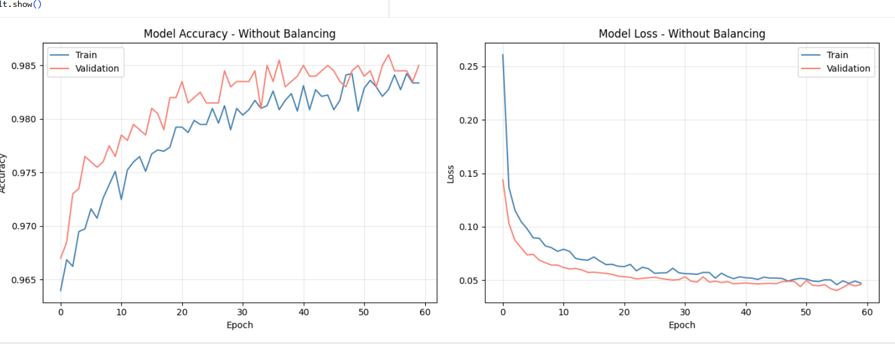
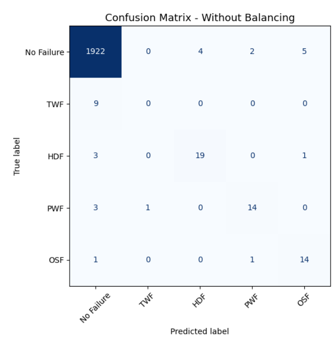
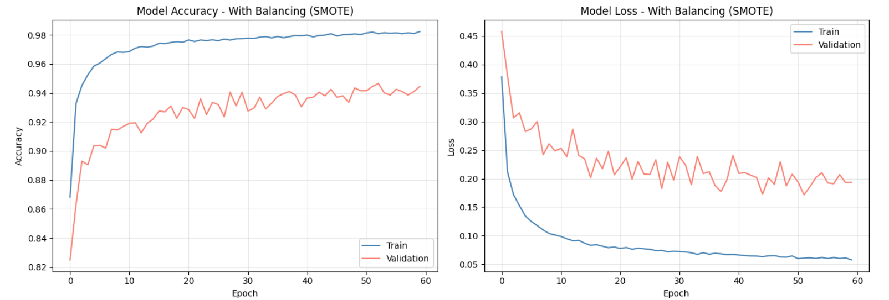
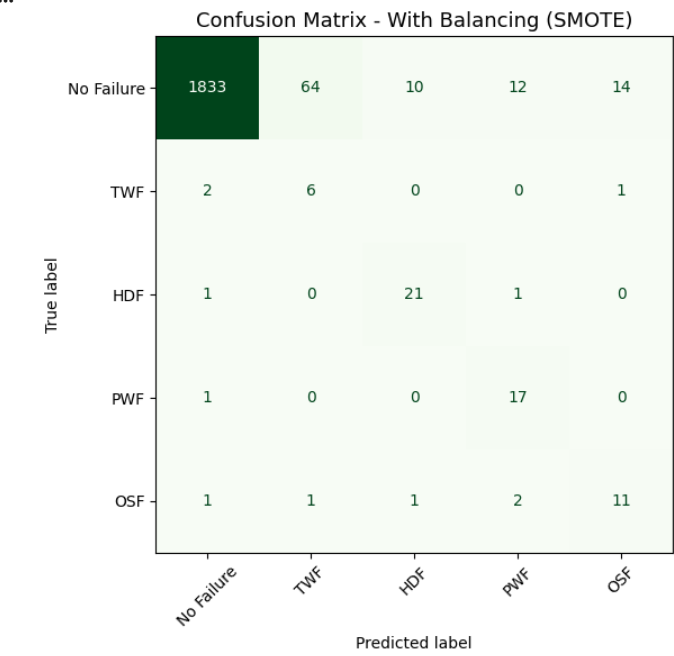
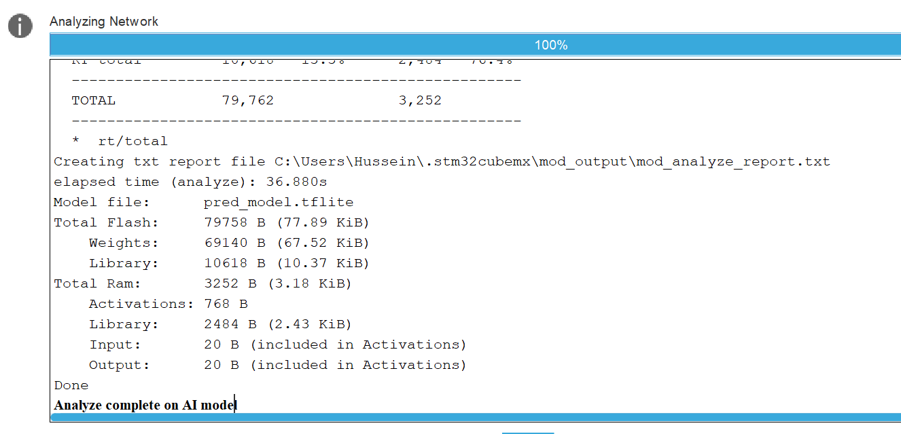
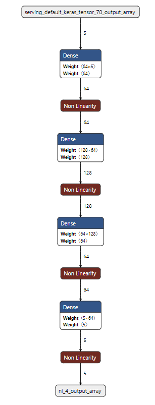
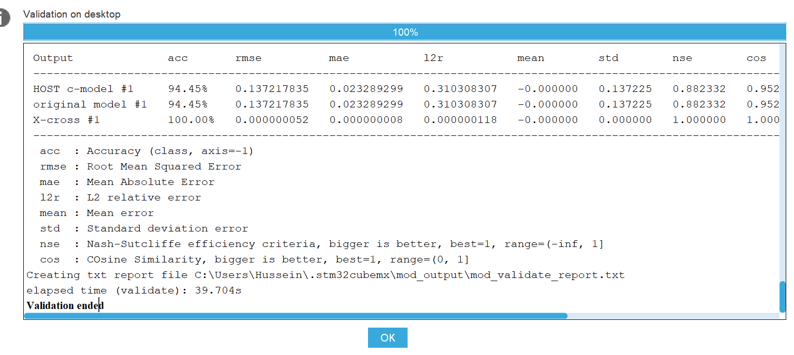
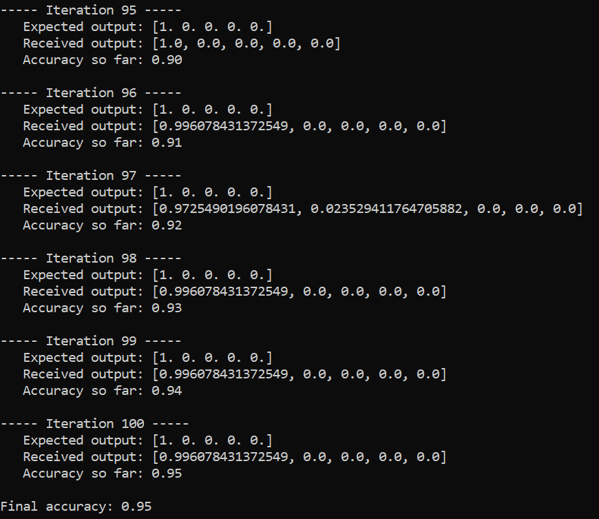

# Projet IA Embarquée — Maintenance Prédictive sur STM32

**Auteurs :** SAYED AHMAD Hussein & NASR Rock  
**École :** Mines Saint-Étienne  
**Année :** 2025-2026

---

## Objectif

Ce projet consiste à concevoir, entraîner et déployer un réseau de neurones profond (DNN) pour la maintenance prédictive industrielle, en utilisant le jeu de données AI4I 2020 Predictive Maintenance Dataset. L'objectif final est de déployer ce modèle sur un microcontrôleur STM32L4R9 via STM32Cube.AI.

---

## Structure du projet
```
IA_Embarque/
├── STM32/embedded/          # Projet STM32CubeIDE
├── model/
│   ├── pred_model.tflite    # Modèle converti pour STM32
│   ├── X_test_pred.npy      # Données de test
│   ├── Y_test_pred.npy      # Labels de test
│   └── communication.py     # Script Python UART
├── TP_IA_EMBARQUE.ipynb     # Notebook Google Colab
├── ai4i2020.csv             # Dataset
└── README.md
```

---

## Installation et Prérequis

### Environnement Python
```bash
pip install tensorflow numpy pandas scikit-learn imbalanced-learn pyserial
```

### Outils STM32
- STM32CubeMX avec X-CUBE-AI 10.2.0
- STM32CubeIDE

---

## QuickStart

1. Ouvrir `TP_IA_EMBARQUE.ipynb` dans Google Colab
2. Exécuter toutes les cellules
3. Télécharger `pred_model.tflite`, `X_test_pred.npy`, `Y_test_pred.npy`
4. Importer le modèle dans STM32CubeMX → Analyser → Générer le code
5. Flasher la carte STM32 via STM32CubeIDE
6. Lancer le script Python :
```bash
cd model
python communication.py
```

---

## Dataset — AI4I 2020 Predictive Maintenance

Le dataset contient **10 000 instances** représentant l'état de fonctionnement de machines industrielles avec 14 colonnes.

**Variables d'entrée utilisées :**
| Variable | Description |
|---|---|
| Air temperature [K] | Température de l'air |
| Process temperature [K] | Température du processus |
| Rotational speed [rpm] | Vitesse de rotation |
| Torque [Nm] | Couple |
| Tool wear [min] | Usure de l'outil |

**Classes de sortie :**
| Classe | Description |
|---|---|
| 0 | No Failure |
| 1 | TWF — Tool Wear Failure |
| 2 | HDF — Heat Dissipation Failure |
| 3 | PWF — Power Failure |
| 4 | OSF — Overstrain Failure |

### Anomalies du dataset
- 9 machines avec `Machine failure = 1` mais aucun type de panne renseigné → **supprimées**
- RNF (Random Failure) avec seulement 19 occurrences → **exclu** car insuffisant pour l'apprentissage

---

## Entraînement du modèle

### Architecture DNN
```
Input (5) → Dense(64, ReLU) → Dropout(0.3)
         → Dense(128, ReLU) → Dropout(0.3)
         → Dense(64, ReLU)
         → Dense(5, Softmax)
```

### Modèle sans rééquilibrage

Le dataset étant fortement déséquilibré (96.6% No Failure), le modèle sans rééquilibrage atteint 98% d'accuracy mais ne détecte aucune panne.




### Modèle avec SMOTE

Pour corriger ce déséquilibre, nous avons appliqué **SMOTE** (Synthetic Minority Oversampling Technique) uniquement sur le set d'entraînement pour éviter toute fuite de données.




**Résultats :**
| | Sans SMOTE | Avec SMOTE |
|---|---|---|
| Accuracy | 98% | 94% |
| Détection pannes | ❌ | ✅ |

---

## Déploiement sur STM32L4R9

### Carte STM32L4R9
- Microcontrôleur ARM Cortex-M4
- 2 Mo de Flash
- 640 Ko de SRAM

### Analyse X-CUBE-AI

Le modèle a été converti en format **TFLite** puis analysé via STM32Cube.AI :



| Ressource | Taille |
|---|---|
| Total Flash | **77.89 KiB** |
| Poids du modèle | 67.52 KiB |
| Total RAM | **3.18 KiB** |
| Activations | 768 B |

### Architecture du réseau embarqué



### Validation sur desktop



| Métrique | Valeur |
|---|---|
| Accuracy HOST | **94.45%** |
| Accuracy modèle original | **94.45%** |

### Communication UART

La communication entre le PC et la STM32 utilise le protocole UART avec les paramètres suivants :
- Baud rate : 115200
- Word length : 8 bits
- Parity : None
- Stop bits : 1

**Protocole de synchronisation :**
1. PC envoie `0xAB`
2. STM32 répond `0xCD`
3. PC envoie les 5 features (20 bytes)
4. STM32 retourne les 5 probabilités (5 bytes)

---

## Résultats finaux



| Métrique | Valeur |
|---|---|
| Accuracy sur STM32 | **95%** |
| Iterations testées | 100 |

---
